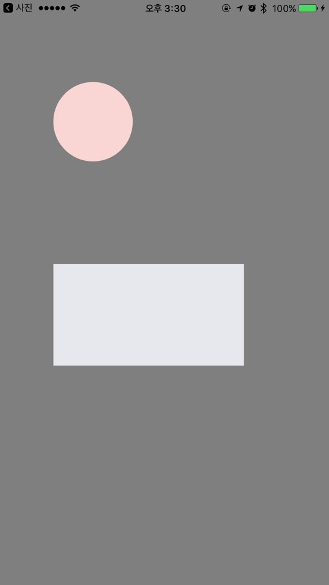
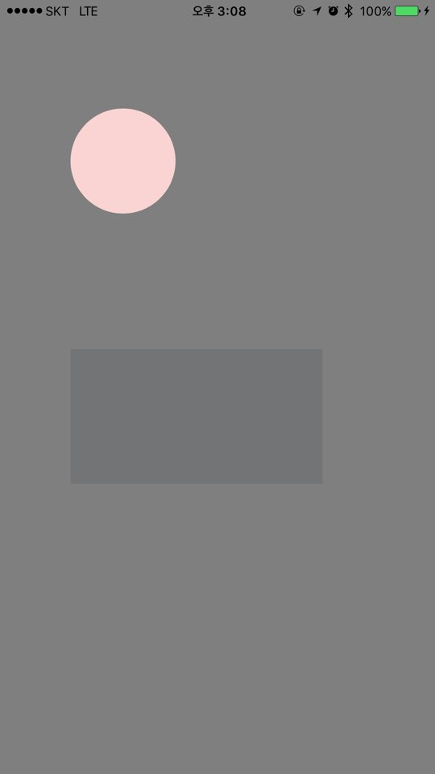

# Shader
[](Package.swift)
[](http://cocoapods.org/pods/Shader)
[](Package.swift)
[](https://developer.apple.com/swift/)
[](https://github.com/younatics/Shader/blob/master/LICENSE)

## Intoduction
#### 🌃 Make simple shade view with Shader!



## Requirements

`Shader` requires Swift 6.0 and iOS 13.0 or later. The Swift package uses Swift tools 6.0, and the CocoaPods deployment target is iOS 13.0.

## Installation

### Swift Package Manager

In Xcode, choose **File ▸ Add Package Dependencies…** and enter:

```
https://github.com/younatics/Shader.git
```

Or add it to your `Package.swift`:

```swift
dependencies: [
    .package(url: "https://github.com/younatics/Shader.git", from: "2.0.0")
]
```

### CocoaPods

Shader is available through [CocoaPods](http://cocoapods.org). To install
it, simply add the following line to your Podfile:

```ruby
pod 'Shader', '~> 2.0.0'
```

## Usage
4 methods is available
```Swift 
// Add multiple view using tuple with cornerRadius
let shaderView = Shader.at(framesAndRadius: [(frame: originView.frame, cornerRadius: 50), (frame: originView2.frame, cornerRadius: 0)], color: UIColor.black.withAlphaComponent(0.5))

// Add common view
let shaderView = Shader.at(frame: originView.frame, color: UIColor.blue.withAlphaComponent(0.3))

// Add common view array
let shaderView = Shader.at(frames: [originView.frame, originView2.frame], color: UIColor.black.withAlphaComponent(0.5))

// Add common view and cornerRadius
let shaderView = Shader.at(frame: originView.frame, cornerRadius: 50, color: UIColor.black.withAlphaComponent(0.5))

self.view.addSubview(shaderView)
```

## References
#### Please tell me or make pull request if you use this library in your application :) 

## Author
[younatics 🇰🇷](https://twitter.com/younatics)

## License
Shader is available under the MIT license. See the LICENSE file for more info.
